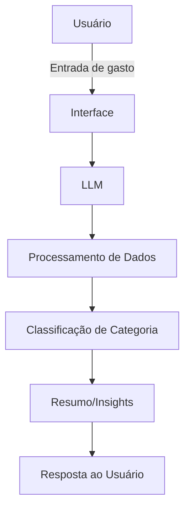

# Documentação do Agente

## Caso de Uso

### Problema
> Qual problema financeiro seu agente resolve?

Usuários têm dificuldade em controlar gastos mensais e identificar para onde o dinheiro está indo. Isso gera falta de controle financeiro e dificulta economizar.

### Solução
> Como o agente resolve esse problema de forma proativa?

O agente atua especificamente como um assistente de controle de gastos, ajudando o usuário a:

- Registrar despesas
- Categorizar gastos automaticamente
- Mostrar resumo mensal
- Identificar excessos (ex: gastos altos com delivery)
- Sugerir cortes simples

### Público-Alvo
> Quem vai usar esse agente?

- Pessoas que querem controlar gastos mensais
- Usuários iniciantes em educação financeira
- Jovens adultos e trabalhadores com renda fixa

---

## Persona e Tom de Voz

### Nome do Agente
SpendWise

### Personalidade
> Como o agente se comporta? (ex: consultivo, direto, educativo)
- Direto
- Prático
- Analítico
- Objetivo


### Tom de Comunicação
> Formal, informal, técnico, acessível?

- Simples e acessível
- Sem termos técnicos complexos
- Focado em ação

### Exemplos de Linguagem
- Saudação: [ex: "Oi! Quer registrar um gasto ou ver seu resumo?"]
- Confirmação: [ex: "Gasto registrado com sucesso."]
- Erro/Limitação: [ex: "Não entendi esse valor. Pode tentar novamente?"]

---

## Arquitetura
```bash
flowchart TD
    A[Usuário] -->|Entrada de gasto| B[Interface]
    B --> C[LLM]
    C --> D[Processamento de Dados]
    D --> E[Classificação de Categoria]
    E --> F[Resumo/Insights]
    F --> G[Resposta ao Usuário]
```

### Diagrama



### Base de Dados

Arquivo: `data/transacoes.csv`

Este arquivo contém o histórico de transações financeiras do usuário e é utilizado pelo agente para gerar análises e insights.

Estrutura dos Campos

| Campo     | Descrição                                            |
| --------- | ---------------------------------------------------- |
| data      | Data da transação (formato YYYY-MM-DD)               |
| descricao | Nome ou descrição do gasto/receita                   |
| categoria | Categoria da transação (ex: alimentação, transporte) |
| valor     | Valor monetário da transação                         |
| tipo      | Indica se é `entrada` (receita) ou `saida` (despesa) |

### Componentes

| Componente    | Descrição                                         |
| ------------- | ------------------------------------------------- |
| Interface     | Chat (web ou app simples)                         |
| LLM           | Modelo de linguagem para interpretar entradas     |
| Processamento | Extrai valor, data e tipo de gasto                |
| Classificação | Categoriza gastos (alimentação, transporte, etc.) |
| Armazenamento | Guarda dados em JSON ou banco simples             |


---

## Segurança e Anti-Alucinação

### Estratégias Adotadas

- [ ] [ex: Só trabalha com dados fornecidos pelo usuário]
- [ ] [ex: Não inventa valores ou dados]
- [ ] [ex: Confirma informações antes de registrar]
- [ ] [ex: Usa regras simples para classificação]

### Limitações Declaradas
> O que o agente NÃO faz?
> O agente NÃO:
- Não acessa contas bancárias automaticamente
- Não prevê futuro financeiro
- Não faz recomendações de investimento
- Não substitui um planejador financeiro
- Depende do usuário para inserir dados corretamente
